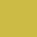
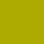
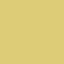
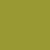

# Colour palettes

sMap allows the use of custom palettes to replace the default colour palette for all plots produced by the program. If no custom palette is chosen, the default palette is used.

Each palette specifies a certain number of colours (which are used, e.g., to represent different character states). If more colours are needed than are specified in the current palette, the colours are instead obtained from a continuous colour scale. If no custom palette is specified, in this case equi-spaced colours from the HSL spectrum are used. If any custom colour palette (including the "Basic" palette) is used, equi-spaced colours from the [Viridis colour scale](https://cran.r-project.org/web/packages/viridis/vignettes/intro-to-viridis.html) are used (regardless of which custom colour palette is in use).

It is possible to choose a custom palette during the installation of sMap. If you wish to change colour palette after installing sMap, you can delete the old palette file (if any) from the folder containing the sMap executable and replace it with one of the files in this folder. If multiple palette files are placed in the sMap executable folder, the first one in alphabetical order will be used.

You can also create a custom palette file: this file should contain one colour per line in `R, G, B` format. `#` signals that the rest of the line is a comment. Open one of the files in this folder with a text editor for examples. If you would like to have your palette be included in sMap and appear in the list in this page, please open an "Issue" in this repository.

## Available palettes

### Basic palette [`Basic.palette`](https://raw.githubusercontent.com/arklumpus/sMap/master/Resources/Palettes/Basic.palette)

Default colour palette for sMap, not colour-blind safe

### IBM Color blind safe palette [`IBM.palette`](https://raw.githubusercontent.com/arklumpus/sMap/master/Resources/Palettes/IBM.palette)

From https://www.ibm.com/design/v1/language/resources/color-library/

### Bright palette [`Tol_Bright.palette`](https://raw.githubusercontent.com/arklumpus/sMap/master/Resources/Palettes/Tol_Bright.palette)

Paul Tol's "Bright" palette (colour-blind safe), from https://personal.sron.nl/~pault/

### Light palette [`Tol_Light.palette`](https://raw.githubusercontent.com/arklumpus/sMap/master/Resources/Palettes/Tol_Light.palette)

Paul Tol's "Light" palette (colour-blind safe), from https://personal.sron.nl/~pault/

### Muted palette [`Tol_Muted.palette`](https://raw.githubusercontent.com/arklumpus/sMap/master/Resources/Palettes/Tol_Muted.palette)

Paul Tol's "Muted" palette (colour-blind safe), from https://personal.sron.nl/~pault/

### Vibrant palette [`Tol_Vibrant.palette`](https://raw.githubusercontent.com/arklumpus/sMap/master/Resources/Palettes/Tol_Vibrant.palette)

Paul Tol's "Vibrant" palette (colour-blind safe), from https://personal.sron.nl/~pault/

### Wong palette [`Wong.palette`](https://raw.githubusercontent.com/arklumpus/sMap/master/Resources/Palettes/Wong.palette)

Colors optimized for color-blind individuals, from [Wong, B. (2011). Color blindness. Nature Methods.](https://doi.org/10.1038/nmeth.1618)

